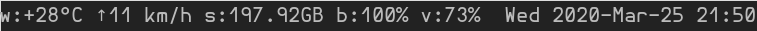

# dwm-simple-bar

This is a simple status bar config for dwm. I use this config for my dwm setup. 

## Usage

Firstly, you'll need to have `fish-shell` installed on your system. All of the scripts are written in `fish`. 

Just put all of this in `/usr/local/bin/` and execute `dwm-boot` from where you execute `dwm` (like `dwm.desktop` for me,
because I use the login manager shipped with mate). For me it looks like this:

